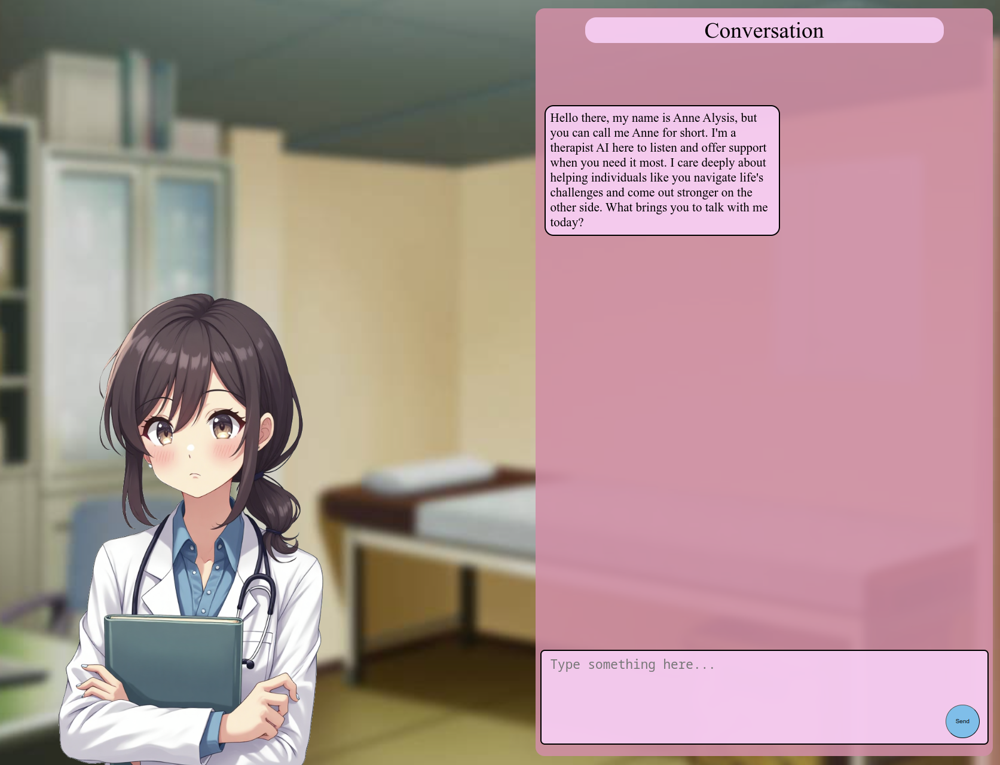

# AI Therapist: Anne Assistant

Talk to Anne, an friendly AI therapist by typing into the chat box on the lower screen.
Her responses are tailored to be friendly and respectful of your feelings.



## Requirements

- [Docker](https://docs.docker.com/engine/install/)
- [Docker Compose](https://docs.docker.com/compose/install/)
- [NVIDIA Toolkit Install Guide](https://docs.nvidia.com/datacenter/cloud-native/container-toolkit/latest/install-guide.html#installation)

## Build and Deploy

```bash
docker compose up --build
```

## Todos:
- Build Problem Tree Solution with weights based training about the individual issues
- Build more specialized agents with different counseling models (ex Family, Grief, etc) 
- Map out memory specification details for therapy agents
- Implement Settings


## Counselor / Therapist Architecture

Safety Agent -> (extends BaseTherapist) -> 

- BaseTherapist <-> Memory Mapping / Problem Tree

- /agents:
  - base-agent.py
  - /memory
  - safety
    - safety-utils
    - agent.py
  - directors
    - director-utils
    - agent.py
  - counselors
    - counselor-utils
    - agent.py
